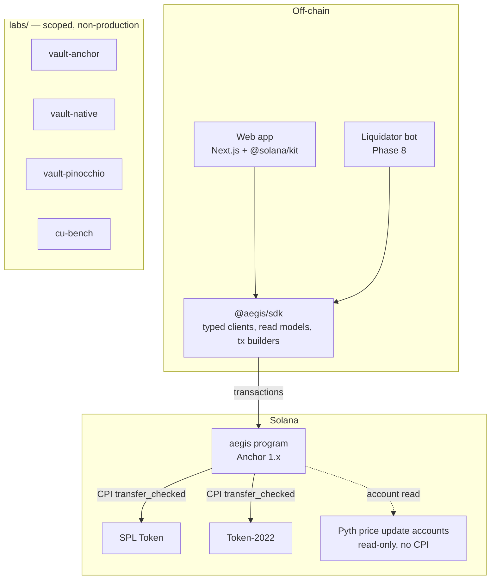
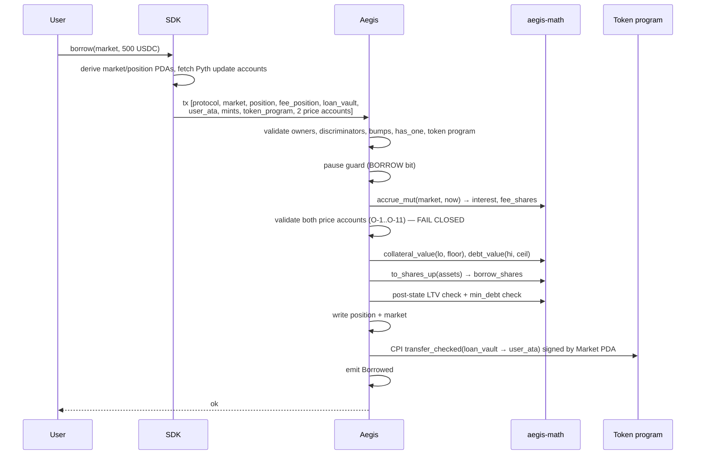
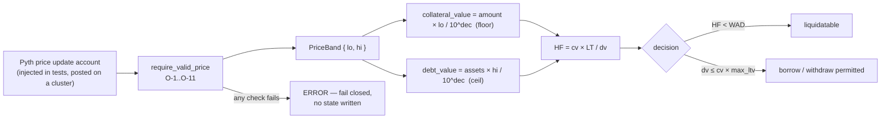

# Aegis — System Architecture

**Status: FROZEN (Phase 0).**

---

## 1. System overview



**One production program.** Aegis is a single Anchor program. There is no program-splitting, no
router, and no proxy. The complexity budget is spent on correctness, not on architecture astronautics.

---

## 2. On-chain module structure

```
programs/aegis/src/
  lib.rs                  // #[program] — instruction entry points only, no logic
  constants.rs            // seeds, WAD, VIRTUAL_*, bounds, MAX_* limits
  error.rs                // the single #[error_code] enum (Anchor 1.0 allows exactly one)
  events.rs               // all #[event] definitions
  state/
    protocol.rs           // Protocol account
    market.rs             // Market account + accrual + param validation
    position.rs           // Position account
  instructions/
    admin/                // initialize_protocol, create_market, set_*, withdraw_collateral_fees
    collateral/           // deposit_collateral, withdraw_collateral
    lend/                 // supply, withdraw
    borrow/               // borrow, repay, accrue_interest
    liquidate/            // liquidate, absorb_bad_debt
    position/             // init_position, close_position
  oracle/
    mod.rs                // PriceSource trait, PriceBand, require_valid_price
    pyth.rs               // the only implementer
  token/
    transfer.rs           // transfer_checked helpers + measured-delta accounting
    policy.rs             // Token-2022 extension allowlist validation
  guards.rs               // pause guard, signer/relation helpers, shared preconditions

crates/aegis-math/        // no_std, float-free, SVM-independent
  fixed.rs                // mul_div_floor / mul_div_ceil with 256-bit intermediates
  shares.rs               // to_shares_*/to_assets_* with virtual offsets
  irm.rs                  // utilization, rate, taylor3
  health.rs               // valuation, health factor, LTV checks
  liquidation.rs          // seizure, bonus, close factor, clamp path

crates/aegis-test-kit/    // TEST ONLY — never a dependency of the program
  svm.rs                  // LiteSVM bootstrap: program, mints, users, market
  pyth_fixture.rs         // byte-exact Pyth price-update account construction
  invariants.rs           // the 9 [GLOBAL] invariant checks, callable after any instruction
  scenarios.rs            // reusable multi-step scenarios
```

### Why `aegis-math` is a separate crate

This is the single most consequential structural decision after the account model:

1. **It can be tested without the SVM.** Property tests and fuzzing run at native speed with no
   validator, no accounts, and no transaction overhead. A fuzz campaign over share arithmetic runs
   millions of cases in the time an SVM test suite runs hundreds.
2. **It enforces NFR-1 mechanically.** The crate is `no_std` and float-free; a float cannot be
   introduced without the build failing.
3. **It makes the economics reviewable in isolation.** A reader can audit the entire economic model as
   pure functions before ever reading an account struct.
4. **It is the natural boundary for the `labs/` benchmarks** — the same math is callable from the
   Anchor, native, and Pinocchio implementations.

`lib.rs` contains no logic. Every handler lives in `instructions/`, and every economic computation
lives in `aegis-math`. An instruction handler's job is: validate accounts → read state → call math →
write state → move tokens → emit event.

---

## 3. Layering and dependency rules

```
lib.rs
  → instructions/*        (account validation, orchestration, CPI)
      → guards.rs         (shared preconditions)
      → oracle/           (price validation)
      → token/            (transfers, policy)
      → state/            (account types, accrual)
          → aegis-math    (pure economics)
```

Enforced rules (CI-checked where possible):

| Rule | Rationale |
|---|---|
| `aegis-math` depends on nothing from `anchor-lang` or `solana-*` | Keeps it fast-testable and float-free |
| `instructions/` never performs raw arithmetic on economic quantities | All economics go through `aegis-math` |
| `state/` never performs a CPI | Keeps token movement in one auditable place |
| No module imports `aegis-test-kit` | Test code must never reach production |
| No direct `solana-program` dependency | Use `anchor_lang`'s re-export (Anchor 1.0 guidance) |
| Exactly one `#[error_code]` enum | Anchor 1.0 requirement |

---

## 4. Request lifecycle (worked example: `borrow`)



**Ordering rule, uniform across all instructions:**
`validate accounts → guard → accrue → validate oracle → compute → write state → move tokens → emit`.

Two properties follow. Writing state before the CPI means a failed transfer aborts the whole
transaction (Solana is atomic), so no partial application is possible. Validating the oracle before
any write means INV-ORA-07 ("a failed oracle check leaves no state modified") holds by construction
rather than by review.

---

## 5. Off-chain architecture

```
sdk/ts/src/
  generated/      // codegen from the Anchor IDL (Program Metadata layout, Anchor 1.x)
  accounts.ts     // decoders for Protocol / Market / Position
  pda.ts          // pure PDA derivation, mirrors the on-chain seeds exactly
  math.ts         // TS port of aegis-math, with cross-checked test vectors
  read.ts         // read models: health, LTV, APYs, liquidation price, utilization
  ix.ts           // transaction builders for every user instruction
  oracle.ts       // Hermes client behind an interface, with an offline fixture impl
```

`sdk/ts/src/math.ts` is a re-implementation, and re-implementations drift. Mitigation: a **shared JSON
vector file** (`tests/vectors/*.json`) is generated by the Rust tests and consumed by the TS tests, so
both implementations are asserted against the same numbers. This is checked in CI (`I-SDK-01`) and is
the only acceptable way to maintain two implementations of the same math.

`app/` is a Next.js application consuming the SDK. It renders market state, position health, and the
full user flow. It points at a local Surfpool by default — the zero-cost demo path.

---

## 6. Data flow: how price reaches a decision



Note the account is **read**, never CPI'd into. This is what makes deterministic offline testing
possible without deploying the Pyth program at all (ADR-0008).

---

## 7. What is deliberately absent

| Absent | Why |
|---|---|
| A router or proxy program | One program; upgrades handled by the BPF loader and Anchor migrations |
| A global registry / index account | Would be a hot-writable global, destroying parallelism |
| An off-chain indexer as a *dependency* | All state is readable directly via `getProgramAccounts` and PDA derivation. An indexer is a scaling optimization, not a correctness requirement |
| A keeper as a *dependency* | Interest accrues lazily and correctly with no keeper; `accrue_interest` exists for observability, not necessity |
| Cross-program state | Nothing outside Aegis holds Aegis state |
| Feature flags altering economics | The deployed artifact must be the tested artifact |

The last row is a rule, not an observation: **no `#[cfg(feature = ...)]` may change on-chain
behavior.** Features may gate IDL generation and test helpers only. This is CI-enforced and is why the
mock oracle was rejected (ADR-0008).

---

## 8. Error handling

One `#[error_code] enum AegisError` (Anchor 1.0 permits exactly one), organized in blocks so error
codes are stable and greppable:

| Range | Category |
|---|---|
| 6000–6019 | Authorization / account validation |
| 6020–6039 | Arithmetic / rounding |
| 6040–6059 | Oracle |
| 6060–6079 | Solvency / health |
| 6080–6099 | Liquidation |
| 6100–6119 | Token / extension policy |
| 6120–6139 | Configuration / bounds |
| 6140–6159 | Lifecycle / state |

Errors must be specific. `InvalidAccount` is banned; `VaultMintMismatch`, `OraclePriceTooStale`,
`LiquidationBonusExceedsThresholdBound` are the standard. Specific errors are how an adversarial test
asserts that the *intended* check fired rather than an incidental one — a test that merely asserts
"the transaction failed" is not a security test.
