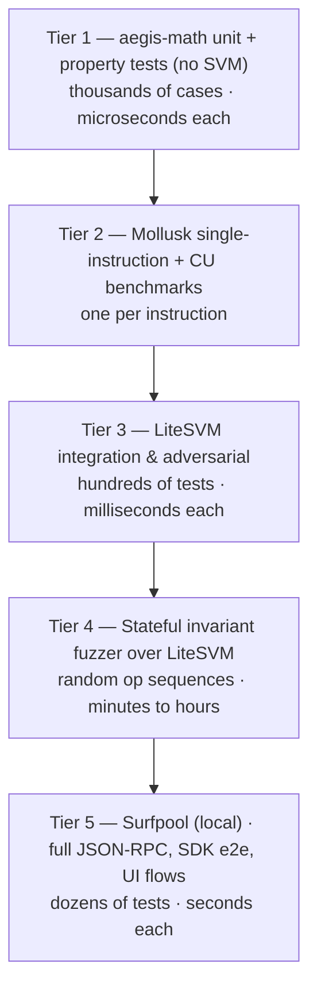

# Aegis — Testing Architecture

**Status: FROZEN (Phase 0).**

> An invariant without a falsifying test is a hope, not an invariant.

---

## 1. The pyramid, and what each tier is *for*

Each tier exists because it tests something no other tier can. Any tier that merely re-tests a lower
tier's behavior is redundant and must be removed.



| Tier | Tool | Tests | Cannot be tested elsewhere |
|---|---|---|---|
| 1 | `cargo test` + `proptest` on `aegis-math` | Arithmetic, rounding, shares, IRM, valuation, liquidation math | Exhaustive numeric edge cases at millions-of-cases scale — impossible in an SVM |
| 2 | Mollusk | One instruction in isolation; **compute-unit measurement** | Precise, low-noise CU figures for a single instruction |
| 3 | LiteSVM (Rust) | Account validation, multi-instruction flows, oracle fixtures, every adversarial case | Real account model, real serialization, real CPI — at speed |
| 4 | LiteSVM + custom driver | Invariant preservation over arbitrary operation sequences | Emergent multi-step bugs no hand-written test would think to write |
| 5 | Surfpool | JSON-RPC surface, SDK codegen, transaction size, UI flow | That the *client* works against a real RPC, and that transactions actually fit |

**Explicitly rejected:** duplicating the LiteSVM suite in TypeScript. Anchor's default TS test harness
is convenient, but re-testing program logic through a second language buys nothing and doubles the
maintenance. TypeScript tests exist **only** at Tier 5, and only to test the SDK and client, which
Rust cannot test.

---

## 2. Tier 1 — `aegis-math`

Runs with `cargo test -p aegis-math`. No SVM, no accounts, no async.

**Unit tests** — every worked example in `economic-model.md` is a test with the exact numbers from
the document. If the document and the code ever disagree, a test fails. This is the mechanism that
keeps the specification honest: `U-IRM-03`, `U-HEALTH-01/02`, `U-LIQ-01` are literally the doc's
worked examples.

**Rounding tests** — `U-ROUND-01..14`, one per row of the rounding law table.

**Property tests** (`proptest`) — `P-ARITH-*`, `P-SHARE-*`, `P-IRM-*`, `P-VAL-*`, `P-LIQ-*`,
`P-FEE-*`, `P-ACCRUE-*` as listed in `economic-model.md` §10.

Two properties deserve special emphasis because they encode the protocol's economic safety:

- `P-SHARE-1..4` — **round-tripping never creates value.** Supply-then-withdraw returns no more than
  was supplied; borrow-then-repay repays no less than was borrowed. This is the direct defense
  against T-17 (exploitable rounding), and it must hold for *all* inputs, not sampled ones.
- `P-LIQ-1` — liquidation improves health whenever `HF > LT·(1+b)`. This is the derived property from
  `economic-model.md` §5.1 and is what makes the parameter bound meaningful rather than decorative.

**Reference-implementation cross-check:** `P-IRM-2` asserts `taylor3(x) ≤ e^x − 1` against a
high-precision rational/bignum reference computed in the test (never in the program).

---

## 3. Tier 2 — Mollusk

One test per instruction, executing that instruction alone against a hand-constructed account set.
Purpose:

1. **CU measurement** with minimal noise — the numbers that go into `benchmarks/`.
2. **Isolated account validation** — the cheapest place to assert "this instruction rejects an account
   with the wrong owner."

Mollusk is *not* used for multi-step flows; that is Tier 3's job.

---

## 4. Tier 3 — LiteSVM (the primary harness)

`crates/aegis-test-kit` provides the bootstrap: deploy the program, create SPL and Token-2022 mints
with chosen extensions, fund users, create a market, inject Pyth fixture accounts.

### 4.1 Integration tests (`I-*`)
Full flows: supply → deposit → borrow → accrue → repay → withdraw; multi-user markets; multi-market
isolation; fee accrual and withdrawal; the complete liquidation and bad-debt lifecycle.

### 4.2 Adversarial tests (`A-*`) — one per threat
Every `T-nn` in the threat model has at least one `A-*` test that **performs the attack and asserts it
fails with the specific expected error**. Asserting a specific error code (not merely "it failed") is
mandatory — otherwise a test passes for the wrong reason, which is worse than no test.

Required adversarial families:
- `A-AUTH-*` — wrong signer, wrong admin, missing signer, guardian clearing a pause bit.
- `A-CUS-*` — substituted vault, wrong mint, wrong token program, direct donation not credited.
- `A-ORACLE-*` — all of O-1..O-11 individually violated, **plus** the positive tests that
  risk-reducing operations still succeed with a fully broken oracle.
- `A-TOK-*` — every rejected extension, plus the unknown-extension positive-allowlist case.
- `A-LIQ-*`, `A-ADM-*`, `A-LIFE-*`, `A-ACC-*`, `A-PAR-*`, `A-SHARE-*`, `A-CPI-*`.

### 4.3 Invariant assertions
`aegis-test-kit::invariants::assert_all(&svm, &market)` checks all nine **[GLOBAL]** invariants. It is
called after **every** instruction in **every** integration test, not just at the end. A helper wraps
instruction submission so this is automatic and cannot be forgotten.

### 4.4 State-unchanged assertions
For every negative test, assert not only that the instruction failed but that **no account changed**.
A check that reverts after a partial write is a real bug class and is invisible to a test that only
inspects the return code.

---

## 5. Tier 4 — Stateful invariant fuzzer

Hand-built, over LiteSVM. Chosen deliberately over an off-the-shelf Anchor fuzzer:

- No dependency on a third-party fuzzer's compatibility with Anchor 1.x (a real risk given how recent
  1.0 is).
- Full control over the operation generator, so it can be biased toward *interesting* states
  (near-`HF = 1`, near-zero liquidity, dust amounts, extreme utilization) rather than uniformly random
  ones that mostly bounce off preconditions.
- The generator itself is portfolio evidence of understanding what makes a lending protocol break.

**Design:**

```
loop:
  op ← weighted_choice(supply, withdraw, deposit_collateral, withdraw_collateral,
                       borrow, repay, liquidate, absorb_bad_debt, accrue, warp_time, move_price)
  actor ← random user
  amount ← biased sampler (0, 1, dust, near-max, max, random)
  execute(op)                       // failures are fine and expected
  assert_all_global_invariants()    // MUST hold whether the op succeeded or failed
```

`warp_time` and `move_price` are first-class operations — most interesting bugs need time to pass or
the price to move, and a fuzzer that cannot do both will only ever find shallow bugs.

**Objectives:**
1. Any **[GLOBAL]** invariant violation.
2. **Value creation** — any actor whose cumulative assets-out exceed assets-in across a whole run
   (targets T-17 directly).
3. Any panic or arithmetic abort not attributable to a documented precondition.

**Mutation validation (mandatory):** for each **[GLOBAL]** invariant, remove its enforcement in a
scratch branch and confirm the fuzzer finds a violation within a bounded budget. An invariant the
fuzzer cannot falsify is not being tested, and the fuzzer is not doing its job. This is a Phase 10
acceptance criterion, not an aspiration.

---

## 6. Tier 5 — Surfpool

Runs in **pure local mode** (no mainnet fetching) for all required tests, keeping NFR-4 intact.

- SDK integration: build → sign → send → confirm → decode, against a real JSON-RPC.
- **Transaction-size verification** (`I-TX-01`): every instruction's realistic transaction fits a
  legacy 1232-byte transaction without an address lookup table. This cannot be tested in LiteSVM and
  is a real failure mode — `liquidate` has 14 accounts.
- IDL / codegen: the generated client matches the deployed program.
- End-to-end UI flow.

**Optional, network-tagged tier** (never required, never in the default suite, marked `#[ignore]` /
`--network`): Surfpool mainnet-fork tests for the Phase 8 Jupiter routing, and devnet Pyth
integration. These require an RPC endpoint and are excluded from CI's required checks.

---

## 7. Test-to-invariant traceability

Every invariant in `invariants.md` carries a test ID. The reverse mapping is enforced:

- `tests/traceability.rs` (or a CI script) parses `docs/invariants.md`, extracts every test ID, and
  asserts each exists in the test suite. **A missing test fails the build.**
- Phase completion requires the phase's invariant rows to be green.

This turns the invariant catalogue from documentation into a build-enforced contract, which is the
only way a document of 87 invariants stays true.

---

## 8. Cross-language vector testing

`aegis-math` (Rust) and `sdk/ts/src/math.ts` (TypeScript) implement the same formulas.

- Rust tests emit `tests/vectors/*.json` containing inputs and expected outputs for every formula.
- TS tests consume the same file and assert identical results.
- CI fails if the vectors are stale relative to the Rust implementation.

This is the only acceptable defense against drift between two implementations, and it is cheap.

---

## 9. CI

| Job | Runs | Blocking |
|---|---|---|
| `fmt` + `clippy -D warnings` | every push | yes |
| `cargo test -p aegis-math` | every push | yes |
| `cargo test --workspace` (LiteSVM tiers 2–4 short budget) | every push | yes |
| `anchor build` + IDL generation | every push | yes |
| Traceability check | every push | yes |
| `CI-NOFLOAT`, `CI-NOINITIF`, `CI-NODUP`, `CI-NOCLOSE`, `CI-NOSLOT`, `CI-NOLOOP` greps | every push | yes |
| `overflow-checks = true` assertion in the release profile | every push | yes |
| CU benchmark + regression threshold | every push | yes (>10% regression fails) |
| Surfpool tier 5 | every push | yes |
| Extended fuzz campaign | nightly / pre-tag | no (reported) |
| Network-tagged tests | manual only | no |

The grep-based checks are crude and that is the point: they are cheap, unambiguous, and they defend
rules that are otherwise enforced only by reviewer memory. Each maps to a named invariant.

---

## 10. What is NOT tested, and why

| Not tested | Reason |
|---|---|
| Pyth's own correctness | Out of scope; it is a stated trust assumption, bounded by O-1..O-11 |
| SPL Token / Token-2022 internals | Trusted programs; we test **our** use of them, including delta accounting |
| Solana runtime guarantees | Trusted |
| Upgrade-authority compromise (T-30) | Not testable in-protocol; addressed in `governance.md` |
| Real-market oracle manipulation (T-20) | Not reproducible locally; documented as accepted residual risk |
| Frontend visual regression | Out of scope for an engineering-evidence repository |

Each row is a deliberate decision, not an omission — which is exactly why the table exists.
