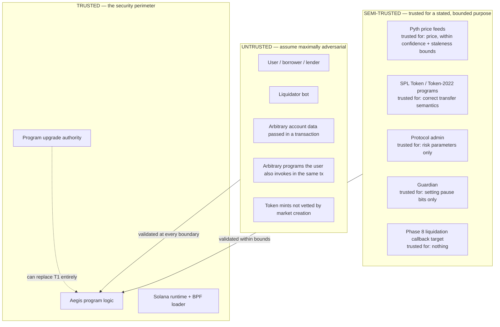

# Aegis — Threat Model

**Status: FROZEN (Phase 0). New threats may be added; mitigations may not be weakened without an ADR.**

---

## 1. Trust boundaries

**The stated trust assumptions, in full:**

| Entity | Trusted for | NOT trusted for |
|---|---|---|
| Solana runtime | Signature verification, account ownership, rent, CPI depth, no cross-program reentrancy of a program already on the stack (**RV-6: verify in Phase 8**) | Anything else |
| SPL Token / Token-2022 | Executing transfers correctly and enforcing mint/decimals in `transfer_checked` | Reporting balances that match our expectations — we always measure deltas |
| Pyth | Publishing a price and an honest confidence interval, verified by Wormhole | Being available, being fresh, being right, or being the feed we asked for — all four are checked |
| Admin | Setting risk parameters within on-chain bounds | Moving funds (structurally impossible, INV-ADM-01) |
| Guardian | Setting pause bits | Clearing them; pausing repay/deposit/absorb (structurally impossible, INV-ADM-04) |
| Upgrade authority | Nothing — it is the largest residual risk in the system and is treated as such in `governance.md` |
| Users / liquidators | Nothing |
| Mints | Nothing — vetted by the extension allowlist at market creation, then pinned |

---

## 2. Threat catalogue

Format: **Asset at risk · Attacker · Entry point · Prerequisite · Impact · Mitigation · Test · Residual risk.**

### T-01 — Missing signer check
- **Asset:** all user funds · **Attacker:** anyone · **Entry:** any value-moving instruction · **Prereq:** none
- **Impact:** Total loss. This is the Wormhole ($320M) bug class and remains the leading cause of Solana exploits.
- **Mitigation:** Anchor `Signer<'info>` plus explicit `has_one = owner`. INV-AUTH-02/03 define exactly which instructions require which signature.
- **Test:** `A-AUTH-02` attempts every owner-gated instruction with a non-owner signer; all must fail.
- **Residual:** None, given test coverage of every instruction. Coverage is enforced by requiring one `A-AUTH-*` case per owner-gated instruction.

### T-02 — Missing / incorrect account owner validation
- **Asset:** all funds · **Attacker:** anyone · **Entry:** any instruction · **Prereq:** ability to create a look-alike account owned by an attacker program
- **Impact:** Attacker-controlled "Market" or "Position" with arbitrary balances → total drain.
- **Mitigation:** `Account<'info, T>` validates owner **and** discriminator; `InterfaceAccount` for token accounts; explicit token-program pinning (INV-CUS-07).
- **Test:** `A-AUTH-06` passes attacker-owned accounts of matching size/layout to every instruction.
- **Residual:** None.

### T-03 — Arbitrary / substituted account
- **Asset:** vault balances · **Attacker:** anyone · **Entry:** `deposit_collateral`, `withdraw_collateral`, `liquidate` · **Prereq:** none
- **Impact:** Redirect withdrawals to an attacker vault, or credit a deposit made to a worthless account.
- **Mitigation:** **Double validation** — the vault must be at its canonical PDA *and* equal `market.collateral_vault` / `market.loan_vault` via `has_one`. Either check alone would suffice; both are present so one omission is not fatal.
- **Test:** `A-CUS-01` substitutes an attacker-controlled token account with the right mint and authority.
- **Residual:** None.

### T-04 — Wrong mint
- **Asset:** vault contents · **Attacker:** anyone · **Entry:** any token instruction · **Prereq:** a worthless mint
- **Impact:** Deposit worthless tokens, receive credit, borrow real value.
- **Mitigation:** `transfer_checked` with the pinned mint and cached decimals; explicit mint equality against `Market`.
- **Test:** `A-CUS-06`.
- **Residual:** None.

### T-05 — Wrong token program
- **Asset:** vault contents · **Attacker:** anyone · **Entry:** any token instruction · **Prereq:** none
- **Impact:** Present a Token-2022 account under the legacy program (or vice versa) to bypass extension semantics.
- **Mitigation:** `market.collateral_token_program` / `loan_token_program` pinned at creation and compared by `require_keys_eq!` on every use. `token_interface` types alone are **not** sufficient and this is stated in the implementation notes.
- **Test:** `A-TOK-08`, `A-TOK-09`.
- **Residual:** None.

### T-06 — Fake oracle account
- **Asset:** all market funds · **Attacker:** anyone · **Entry:** `borrow`, `withdraw_collateral`, `liquidate` · **Prereq:** none
- **Impact:** Arbitrary prices → borrow everything against nothing, or liquidate everyone.
- **Mitigation:** Oracle checks O-1..O-11 (`oracle-design.md` §2), all fail-closed.
- **Test:** `A-ORACLE-06..12`.
- **Residual:** None for account forgery. Genuine market manipulation of Pyth itself is T-20.

### T-07 — Mismatched oracle feed
- **Asset:** market funds · **Attacker:** anyone · **Entry:** priced instructions · **Prereq:** none
- **Impact:** Pass a $1 asset's feed as a $100,000 asset's price.
- **Mitigation:** O-3 — identity is the **feed ID**, not the account address (pull-oracle accounts are ephemeral and cannot be pinned by address). O-11 requires the two price accounts to be distinct.
- **Test:** `A-ORACLE-07`, `A-ORACLE-12`.
- **Residual:** None.

### T-08 — Stale price
- **Asset:** market funds · **Attacker:** liquidator or borrower · **Entry:** priced instructions · **Prereq:** price has moved since the last update
- **Impact:** Borrow against a stale-high collateral price; liquidate against a stale-low one.
- **Mitigation:** O-5 with `max_price_age_secs` (30s majors / 120s stables), measured in **unix seconds** (INV-ORA-06 — slot-based windows are unsafe under SIMD-0525).
- **Test:** `A-ORACLE-03`, plus boundary tests at exactly the threshold.
- **Residual:** A price up to `max_price_age_secs` old is accepted. Bounded and parameterized.

### T-09 — PDA seed collision / seed sharing
- **Asset:** any account · **Attacker:** anyone · **Entry:** account derivation · **Prereq:** overlapping seed structures
- **Impact:** One user's position aliasing another's; a market aliasing a position.
- **Mitigation:** Distinct literal prefixes per account type; all variable seeds are fixed-width (32-byte pubkeys, `u16`), so no concatenation ambiguity exists.
- **Test:** `U-LIFE-02` asserts prefix distinctness; `A-LIFE-03` attempts cross-type derivation.
- **Residual:** None.

### T-10 — Non-canonical bump
- **Asset:** any PDA account · **Attacker:** anyone · **Entry:** account derivation · **Prereq:** none
- **Impact:** Multiple valid addresses for one logical account → duplicate positions, bypassed uniqueness.
- **Mitigation:** Canonical bump found at creation, stored, and reused via `bump = acct.bump` (INV-LIFE-05).
- **Test:** `A-LIFE-03` attempts a non-canonical bump.
- **Residual:** None.

### T-11 — Duplicate mutable accounts
- **Asset:** accounting integrity · **Attacker:** anyone · **Entry:** instructions taking two accounts of the same type · **Prereq:** none
- **Impact:** Passing the same `Position` as both source and destination, so one write clobbers the other and value is duplicated. Classic on Solana.
- **Mitigation:** **Anchor 1.0 disallows duplicate mutable accounts by default**; the `dup` constraint is never used in Aegis. Relevant sites: `absorb_bad_debt` (`position` vs `fee_position`), `liquidate` (`position` vs `fee_position`), any two-position future instruction.
- **Test:** `A-ACC-01` passes `fee_position == position`; must fail.
- **Residual:** None while `dup` remains unused — enforced by a CI grep (`CI-NODUP`).

### T-12 — Account reinitialization
- **Asset:** position balances · **Attacker:** position owner or anyone · **Entry:** `init_position` · **Prereq:** none
- **Impact:** Reset a position with outstanding debt to zero — debt erased, collateral retained.
- **Mitigation:** No `init_if_needed` anywhere (CI-enforced). Anchor `init` fails if the account exists.
- **Test:** `A-LIFE-01`; `CI-NOINITIF` greps the source.
- **Residual:** None.

### T-13 — Unsafe close / revival
- **Asset:** position balances · **Attacker:** position owner · **Entry:** `close_position` · **Prereq:** none
- **Impact:** Close an account with debt, or revive a closed account carrying stale data.
- **Mitigation:** Exact zero checks on all three balances; Anchor's `close =` (not a hand-rolled discriminator pattern — `CLOSED_ACCOUNT_DISCRIMINATOR` was removed in Anchor 1.0 and manual closes are the known revival vector).
- **Test:** `U-LIFE-01`, `A-LIFE-02`.
- **Residual:** None.

### T-14 — Stale account state after CPI
- **Asset:** accounting integrity · **Attacker:** anyone using a fee-bearing mint · **Entry:** every vault inflow · **Prereq:** Token-2022 transfer fee
- **Impact:** Credit the requested amount rather than the received amount → INV-CUS-02 broken → vault drained over time.
- **Mitigation:** Mandatory `vault.reload()` after every transfer CPI, then `credited = after − before` (INV-CUS-05).
- **Test:** `U-TOK-02`, `A-TOK-10`, `A-TOK-11` (fee rate changed mid-lifecycle).
- **Residual:** None.

### T-15 — Privilege propagation through CPI
- **Asset:** user wallets · **Attacker:** malicious program · **Entry:** Phase 8 liquidation callback · **Prereq:** user invokes Aegis with a hostile callback target
- **Impact:** Aegis forwards a signer privilege to an attacker program, which drains the signer's accounts.
- **Mitigation:** Aegis never forwards user signer privileges (INV-AUTH-07). The only PDA signature is the market's, used solely for its own two vaults. The Phase 8 callback is invoked with **no** Aegis-derived signer and no user signer.
- **Test:** `A-CPI-01` — a hostile callback attempts to move the liquidator's and the vault's tokens.
- **Residual:** Phase 8 only; gated on RV-6 and on post-condition verification.

### T-16 — Integer overflow / truncation
- **Asset:** all accounting · **Attacker:** anyone · **Entry:** any arithmetic · **Prereq:** large but legal values
- **Impact:** Wrapped values → free money. Release builds do **not** check overflow by default.
- **Mitigation:** `overflow-checks = true` in the release profile (**mandatory Phase 1 item**); all economics via `mul_div_*` with 256-bit intermediates; no `as` casts that can truncate (CI-enforced grep for `as u64` / `as u128` in the economics module).
- **Test:** `P-ARITH-1..3`, including the maximum-legal-state case that overflows a naive `u128` implementation.
- **Residual:** None.

### T-17 — Exploitable rounding
- **Asset:** pool assets · **Attacker:** anyone, repeatedly · **Entry:** supply/withdraw/borrow/repay · **Prereq:** many small transactions
- **Impact:** Extract 1 base unit per round-trip until the pool is drained.
- **Mitigation:** The rounding law (`economic-model.md` §1.3) — every direction favors the protocol; each of the 14 directions has its own unit test. Round-trip properties `P-SHARE-1..4` assert that no sequence creates value.
- **Test:** `P-SHARE-1..4`, plus a fuzz campaign specifically searching for value creation over random operation sequences.
- **Residual:** Sub-unit dust may accumulate **in the protocol's favor**, which is the intended direction.

### T-18 — First-depositor share inflation
- **Asset:** later lenders' deposits · **Attacker:** first depositor · **Entry:** `supply` · **Prereq:** empty market
- **Impact:** Inflate share price, steal a large fraction of the next depositor's funds.
- **Mitigation:** `VIRTUAL_SHARES = 1e6` / `VIRTUAL_ASSETS = 1` offsets, **and** INV-CUS-08 (donations are never credited), which removes the direct-donation vector entirely.
- **Test:** `A-SHARE-01` runs the attack with the offsets disabled (must succeed) and enabled (must be unprofitable).
- **Residual:** None material.

### T-19 — Decimal mismatch
- **Asset:** valuation correctness · **Attacker:** anyone · **Entry:** valuation · **Prereq:** assets with differing decimals
- **Impact:** Value a 9-decimal asset as a 6-decimal one → 1000× mispricing → total drain.
- **Mitigation:** Decimals cached from the mints at creation (immutable in both token programs) and applied explicitly in every valuation.
- **Test:** `P-VAL-1` covers every decimals pair in `0..=12` crossed with `expo ∈ {−12..0}`.
- **Residual:** None.

### T-20 — Oracle price manipulation (real market)
- **Asset:** market funds · **Attacker:** well-capitalized · **Entry:** the underlying market, not Aegis · **Prereq:** capital to move the real price
- **Impact:** Borrow against inflated collateral; force liquidations.
- **Mitigation:** Outside Aegis's control. Partially addressed by `max_conf_bps` (publisher disagreement widens confidence during manipulation) and by conservative LTVs.
- **Test:** Not testable in-protocol; documented.
- **Residual:** **Accepted and stated.** This is inherent to every oracle-based protocol. Production mitigation is multi-source oracles, TWAP sanity bands, and supply caps — all listed as v1 simplifications (`economic-model.md` §11).

### T-21 — Oracle downtime → bad debt
- **Asset:** lender funds · **Attacker:** none (environmental) · **Entry:** all priced instructions · **Prereq:** outage during a price move
- **Impact:** Liquidations blocked while positions decay; bad debt on recovery.
- **Mitigation:** Fail-closed is chosen deliberately over fail-open (`oracle-design.md` §4.1). `absorb_bad_debt` needs no oracle, so loss recognition is never blocked. Guardian can pause `BORROW` to stop the hole deepening.
- **Test:** `A-ORACLE-10` simulates an outage across a price move and asserts the accounting stays consistent through recovery.
- **Residual:** **Accepted and stated.** Contained to one market by ADR-0004.

### T-22 — Self-liquidation
- **Asset:** none · **Attacker:** position owner · **Entry:** `liquidate` · **Prereq:** own position is unhealthy
- **Impact:** Analyzed and found to be **not an attack.** The owner pays the bonus to themselves minus `liq_protocol_fee`, so it is strictly worse than simply repaying. It is permitted.
- **Mitigation:** None needed. Deliberately **not** blocked: a self-liquidation check would require identifying the beneficiary of the liquidator's token accounts, which is unreliable and would break legitimate bot architectures.
- **Test:** `U-LIQ-07` asserts self-liquidation is permitted and unprofitable relative to repayment.
- **Residual:** None.

### T-23 — Liquidation griefing / over-liquidation
- **Asset:** borrower funds · **Attacker:** liquidator · **Entry:** `liquidate` · **Prereq:** position marginally unhealthy
- **Impact:** Repeated maximal liquidations extract more bonus than necessary to restore health.
- **Mitigation:** `close_factor` caps a single partial liquidation; each liquidation must move HF toward safety (INV-LIQ-05); `min_debt` prevents dust-sized griefing; each attempt costs a transaction fee.
- **Test:** `U-LIQ-04`, `P-LIQ-1`.
- **Residual:** A borrower at `HF = WAD − 1` can be liquidated for `close_factor` of their debt. Inherent to fixed-bonus liquidation; a Dutch auction is the documented v2 answer.

### T-24 — Death-spiral liquidation
- **Asset:** lender funds · **Attacker:** none (structural) · **Entry:** `liquidate` · **Prereq:** `HF < liq_threshold · (1 + liq_bonus)`
- **Impact:** Each partial liquidation *reduces* HF further, driving the position to insolvency.
- **Mitigation:** **Derived, not guessed** (`economic-model.md` §5.1): liquidation improves HF iff `HF > LT·(1+b)`. `create_market` enforces `LT·(1+b) < WAD` so liquidation is improving at the trigger point, and `full_liq_hf` allows 100% liquidation inside the adverse band.
- **Test:** `P-LIQ-1`, `P-LIQ-4`, `A-ADM-04` (parameter set violating the bound must be rejected).
- **Residual:** None, given the enforced bound.

### T-25 — Unliquidatable dust
- **Asset:** lender funds · **Attacker:** anyone · **Entry:** `borrow` · **Prereq:** cheap transactions
- **Impact:** Thousands of positions too small to liquidate profitably → accumulated bad debt.
- **Mitigation:** `min_debt` floor enforced on `borrow` and on partial liquidation (INV-SOLV-07).
- **Test:** `U-BORROW-02`, `U-LIQ-04`.
- **Residual:** `min_debt` is a fixed base-unit amount and does not adapt to gas or price. Documented as a v1 simplification.

### T-26 — Hostile token extension
- **Asset:** vault contents · **Attacker:** mint authority · **Entry:** `create_market` · **Prereq:** admin creates a market for a hostile mint
- **Impact:** Permanent delegate drains the vault; pausable mint blocks liquidation; close authority enables a mint reinit that invalidates every creation-time check.
- **Mitigation:** **Positive allowlist** at market creation (`token-compatibility.md`). Unknown extensions are rejected by default.
- **Test:** `A-TOK-01..05`.
- **Residual:** The admin can still create a market for a *legitimately-extended* mint whose issuer later behaves badly (e.g. exercising a freeze authority). Handled by the explicit `ack_freeze_authority` acknowledgement rather than by pretending the risk is absent.

### T-27 — Compute exhaustion / DoS
- **Asset:** protocol liveness · **Attacker:** anyone · **Entry:** any instruction · **Prereq:** an unbounded operation
- **Impact:** An instruction that cannot fit the CU budget is permanently unusable — for liquidation that means guaranteed bad debt.
- **Mitigation:** No unbounded loops (INV-RES-04, CI-enforced); fixed account counts; transfer hooks rejected (they would allow a mint to make transfers arbitrarily expensive); every instruction benchmarked against the 200k budget (INV-RES-01).
- **Test:** `B-CU-*` benchmarks in CI with a regression threshold.
- **Residual:** None known.

### T-28 — Account contention DoS
- **Asset:** protocol liveness · **Attacker:** anyone · **Entry:** high-frequency writes to a hot account · **Prereq:** none
- **Impact:** Spamming `accrue_interest` write-locks `Market`, starving legitimate users.
- **Mitigation:** Contention is bounded to a single market (INV-RES-03). Collateral operations avoid the `Market` write entirely (INV-RES-02). `accrue_interest` with `dt == 0` is a no-op, so spam produces no economic effect and the attacker pays fees.
- **Test:** `A-PAR-01`, `A-PAR-02`.
- **Residual:** A determined attacker can degrade one market's throughput at their own cost. Inherent to Solana's account-locking model; isolation bounds the blast radius.

### T-29 — Unsafe admin configuration
- **Asset:** all market funds · **Attacker:** compromised or careless admin · **Entry:** `create_market`, `set_market_params` · **Prereq:** admin key
- **Impact:** `max_ltv = 99%` → instantly insolvent market; `liq_bonus = 90%` → liquidators seize everything.
- **Mitigation:** On-chain bounds validated on **every** write (INV-ADM-05), including the derived `LT·(1+b) < WAD` constraint. Phase 12 adds a timelock for risk-*increasing* changes only.
- **Test:** `A-ADM-04` sweeps out-of-bounds parameter sets; all must be rejected.
- **Residual:** The admin can still choose a legal-but-unwise parameter set. Bounded by the on-chain limits and, from Phase 12, delayed and publicly observable.

### T-30 — Compromised upgrade authority
- **Asset:** **everything** · **Attacker:** whoever holds the upgrade key · **Entry:** BPF loader · **Prereq:** key compromise
- **Impact:** Total, immediate, unmitigable loss. Every other mitigation in this document is void.
- **Mitigation:** Not a code problem. Progressive hardening in `governance.md`: local keypair → hardware-backed single key → multisig → (optionally) revoked authority. Verifiable builds so deployed bytecode can be checked against source.
- **Test:** Not testable in-protocol.
- **Residual:** **The single largest residual risk in Aegis, stated plainly.** No amount of in-program security compensates for it, and any claim that the protocol is "safe" without addressing it is false.

### T-31 — Malicious external integration (Phase 8)
- **Asset:** liquidator funds; protocol liveness · **Attacker:** callback target · **Entry:** liquidation callback · **Prereq:** liquidator supplies a hostile program
- **Impact:** Reentrancy into Aegis; state read before the callback becoming stale after it; consuming the CU budget.
- **Mitigation:** No signer forwarded (INV-AUTH-07); **all state re-read and all post-conditions re-verified after the callback returns**; the callback is opt-in per transaction; RV-6 (runtime reentrancy semantics) resolved before implementation.
- **Test:** `A-CPI-01..04` — hostile callbacks that reenter, that consume CU, that return without repaying, and that attempt to move vault funds.
- **Residual:** Contained to the calling liquidator, who chose the callback. Deferred entirely until Phase 8.

### T-32 — Front-running protocol initialization
- **Asset:** protocol control · **Attacker:** observer of the deploy · **Entry:** `initialize_protocol` · **Prereq:** program deployed but uninitialized
- **Impact:** Attacker becomes admin.
- **Mitigation:** Deploy and initialize as one operational step; the Phase 2 deployment checklist requires asserting `protocol.admin` before any market is created or funded.
- **Test:** `I-DEPLOY-01` asserts the post-deploy admin.
- **Residual:** Operational, not algorithmic. Bounded because an uninitialized protocol holds no funds.

---

## 3. Threats by asset

| Asset at risk | Threats |
|---|---|
| Collateral in vaults | T-01, T-02, T-03, T-04, T-05, T-14, T-26, T-30 |
| Loan liquidity | T-01, T-06, T-07, T-08, T-16, T-17, T-18, T-20, T-30 |
| Lender share value | T-17, T-18, T-21, T-24, T-25, T-29 |
| Borrower collateral (unfair seizure) | T-06, T-07, T-08, T-23, T-24, T-29 |
| Protocol liveness | T-26, T-27, T-28, T-31 |
| Governance control | T-29, T-30, T-32 |
| Accounting integrity | T-11, T-12, T-13, T-14, T-16, T-17, T-19 |

## 4. Residual risks accepted for v1

Consolidated, so no reader has to infer them:

1. **T-30 upgrade authority** — total compromise possible; mitigated only operationally.
2. **T-20 real-market oracle manipulation** — inherent; single-source oracle in v1.
3. **T-21 oracle downtime → bad debt** — deliberate consequence of failing closed.
4. **T-23 over-liquidation within the close factor** — inherent to fixed-bonus liquidation.
5. **T-25 dust adaptivity** — `min_debt` is static.
6. **T-26 issuer misbehavior on a legitimately-extended mint** — acknowledged via `ack_freeze_authority`.
7. **T-28 single-market contention DoS** — inherent to account locking; blast radius bounded by isolation.
8. **T-29 legal-but-unwise parameters** — bounded on-chain, timelocked from Phase 12.

**Aegis v1 must not be deployed to mainnet with real user capital.** These residuals, plus the absence
of an external audit and of quantitative risk calibration, are why.

## 5. Adversarial test campaign (Phase 10)

1. **Per-threat regression tests** — one named test per T-nn above, each of which must fail if its
   mitigation is removed.
2. **Stateful invariant fuzzer** — random sequences of every instruction across multiple users and
   markets, with randomized prices, asserting all nine **[GLOBAL]** invariants after every step.
3. **Value-creation search** — a fuzz objective that searches specifically for any sequence in which a
   user's assets-out exceed assets-in, targeting T-17.
4. **Exploit-regression suite** — every bug found during development is frozen as a permanent test
   with a comment naming the threat ID.
5. **Mutation check** — for each **[GLOBAL]** invariant, deliberately remove its enforcement and
   confirm the fuzzer finds a violation. An invariant the fuzzer cannot falsify is not being tested.
